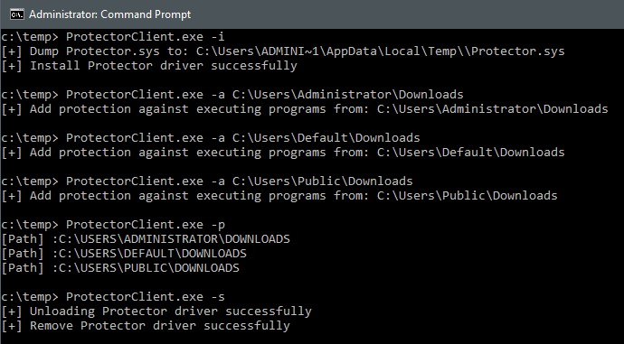
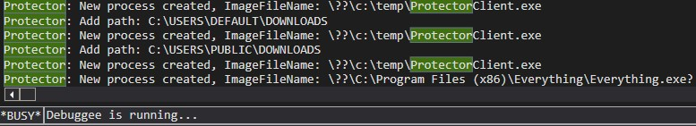
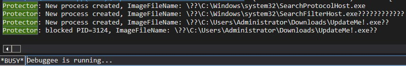
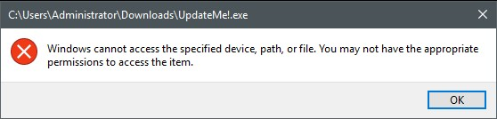

# Protector
Kernel driver to monitor execution of programs from paths defined to be avoided by the user.

---

### How to use
##### ProtectorClient CLI options
```Bash
c:\> ProtectorClient.exe
Usage: ProtectorClient.exe [option(s)]
Options:
        -h,--help               Show this help message
        -i,--install            Dump Protector.sys and load it
        -s,--stop               Stop Protector driver, unload it and cleanup the executable
        -a,--append <PATH>      Specify path to protect from
        -r,--remove <PATH>      Specify path to remove from protection
        -p,--paths              Show all the defined paths
        -e,--events             Show event of blocked execution
```

##### Use case example
Show CLI commands:

</img>

</img>

(-i) Installing Protector driver
(-a <path>) Adding malicious paths to protect from

</img>

(-p) Verify the paths
<i>Now Protector preform the protections</i>

</img>

Dangerous programs would be blocked from executing:

</img>

(-s) Uninstall Protector driver


### Notes
* Turn your machine to test-signing mode in order to use Protector.

---

### ToDo
- [ ] Add object notification
- [ ] Add class in Kernel-Code to wrap all protector logic 
- [ ] Add data structure to hold blocked-program events
- [ ] Add Kernel & user mode support for getting events data

---

### Useful links
* OSR Windows Linked Lists tutorial - https://www.osronline.com/article.cfm%5Earticle=499.htm
* DebugView not showing KdPrint output - https://stackoverflow.com/a/45627365
* Resources in Visual Studio - https://www.ired.team/offensive-security/code-injection-process-injection/loading-and-executing-shellcode-from-portable-executable-resources
* UNICODE_STRING not guaranteed to be NULL-terminated - https://community.osr.com/discussion/243646/wcsstr-in-kernel
* Global variables in Kernel-Code - LNK2019 unresolved external symbol atexit referenced in function "void __cdecl `dynamic initializer for 'xxxx''(void)" - https://community.osr.com/discussion/144190/unresolved-external-symbol-atexit
---


### Common issues
#### Resource file opened in another editor
When using `Resource View` in `Visual Studio` you can get this error sometimes. <br>
I've used `Notepad++` to open the file from the local folder and then try to open the `Resource View` again and it fixed the problem.