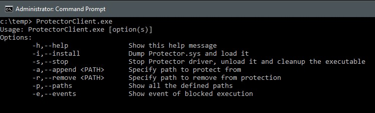
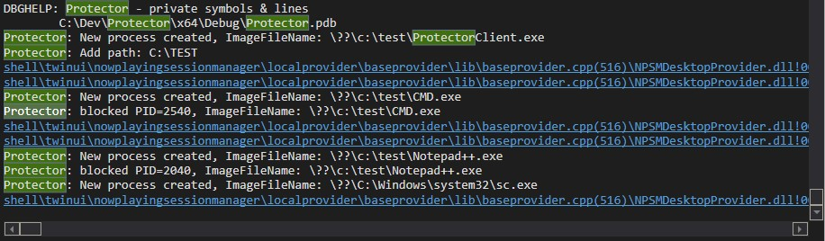

# Protector
Kernel driver to monitor execution of programs from paths defined to be avoided by the user.

---

### How to use
1. Install the driver - run the following command using CMD:
```shell
    sc create protector type= kernel binPath= <location of Protector.sys file>
```
2. Load the driver to kernel space - run the following command using CMD:

```shell
    sc start protector
```
3. Use the Protector CLI - ToDO
   * <code>ProtectorClient.exe -h</code> - get help information
   * <code>ProtectorClient.exe -a \<path></code> - add new path
   * <code>ProtectorClient.exe -r \<path></code> - remove existing path
   * <code>ProtectorClient.exe -p </code> - get all defined paths
   * <code>ProtectorClient.exe -e</code> - consume events from driver
---

### Example of running Protector
</img>
</img>
* Protector driver have been loaded to kernel space and start running
* ProtectorClient have been used to add path to protect from: "C:\TEST"
* Protector driver monitoring process executions
* Protector have been blocking programs execution from the blocked path
---

### Notes
* Turn your machine to test-signing mode in order to use Protector.

---

### ToDo
- [X] Add notification to processes
- [X] Search for execution for monitored paths
- [X] Add data structure to hold multiple paths
- [ ] Add data structure to hold event (attempts to run program from monitored path)
- [ ] Update client application to support all the functionality

---

### Useful links
* OSR Windows Linked Lists tutorial - https://www.osronline.com/article.cfm%5Earticle=499.htm
* DebugView not showing KdPrint output - https://stackoverflow.com/a/45627365
* 